# AWS Observability & Cost Analysis

## 📌 Overview
This project implements **Observability & Cost Analysis** on the **AWS platform**.  
The lab demonstrates how to monitor EC2 performance, configure CloudWatch alarms, simulate high CPU usage, visualize metrics using dashboards, and analyze system behavior for cost awareness and optimization.

---

## 🎯 Objectives
- Enable monitoring for AWS resources  
- Observe key performance metrics (CPU, Network)  
- Configure and test CloudWatch alarms  
- Visualize metrics using dashboards  
- Understand resource usage and cost impact  

---

## 🛠️ AWS Services Used
- Amazon EC2  
- Amazon CloudWatch (Metrics, Alarms, Dashboards)  
- AWS CloudShell  
- Ubuntu 22.04 (EC2 Instance)  

---

## 📂 Screenshots Directory Structure
All screenshots are stored inside the `screenshots/` directory.

---

## 🧪 Step-by-Step Implementation

---

### Step 1️⃣: CloudWatch Metrics Dashboard
CloudWatch metrics were explored to monitor EC2 instance performance, including CPU utilization and network traffic.

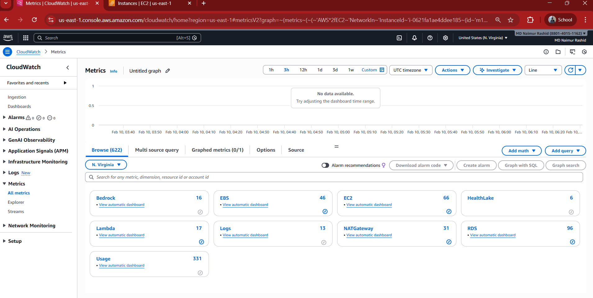

---

### Step 2️⃣: EC2 Metrics List View
Viewed all available EC2 metrics such as CPU, Network In/Out, and credit usage.

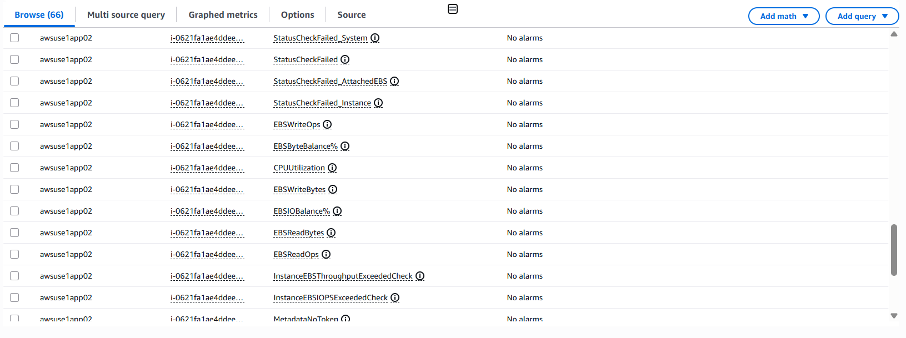

---

### Step 3️⃣: CPU Utilization Metric Graph
Observed CPU utilization trends over time to understand baseline performance.

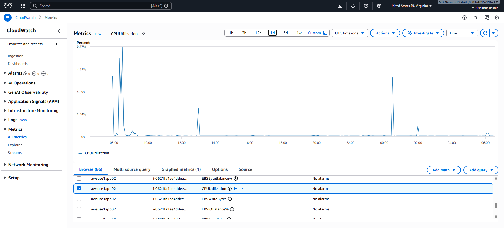

---

### Step 4️⃣: Detailed EC2 Monitoring Overview
Reviewed detailed monitoring options and enabled performance insights.

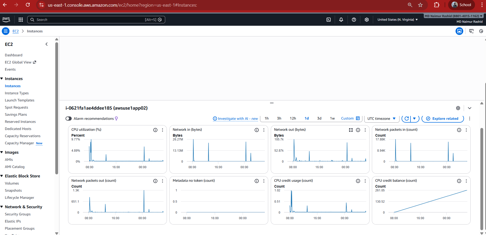

---

### Step 5️⃣: CloudWatch Alarm – Metric Selection
Created a CloudWatch alarm by selecting the **CPUUtilization** metric.

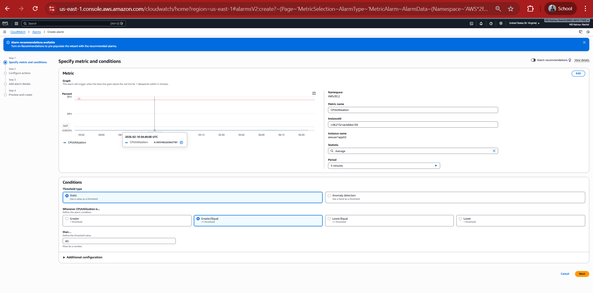

---

### Step 6️⃣: Alarm Action Configuration
Configured alarm actions such as notifications when the threshold is breached.

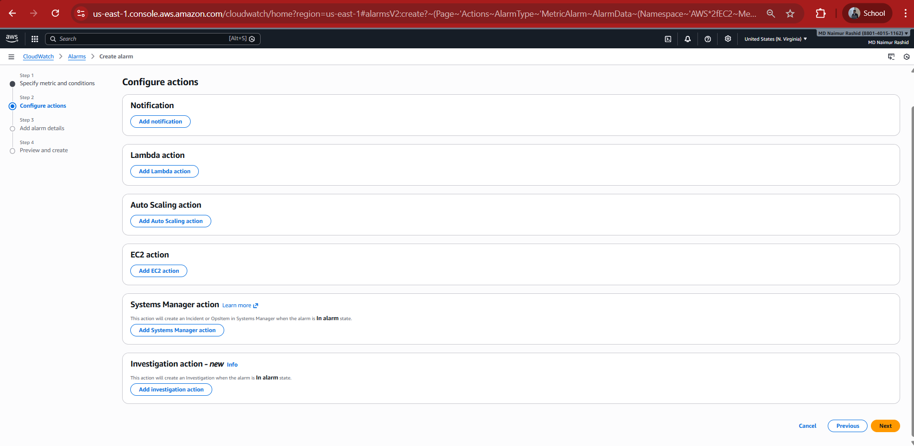

---

### Step 7️⃣: Alarm Details Configuration
Added alarm name, description, threshold (≥ 80%), and evaluation period.

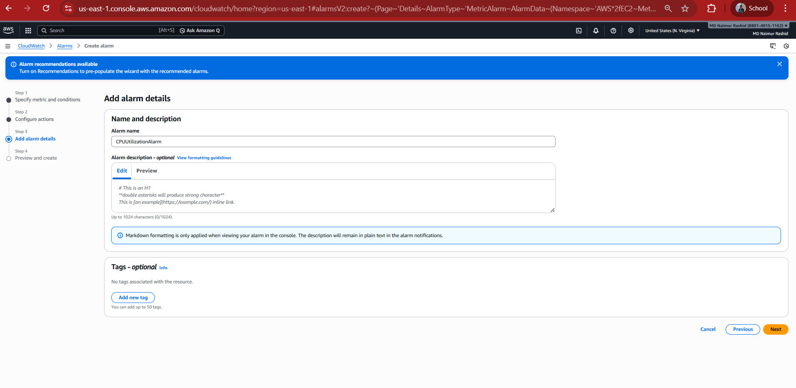

---

### Step 8️⃣: Alarm Review and Creation
Reviewed the alarm configuration and successfully created the alarm.

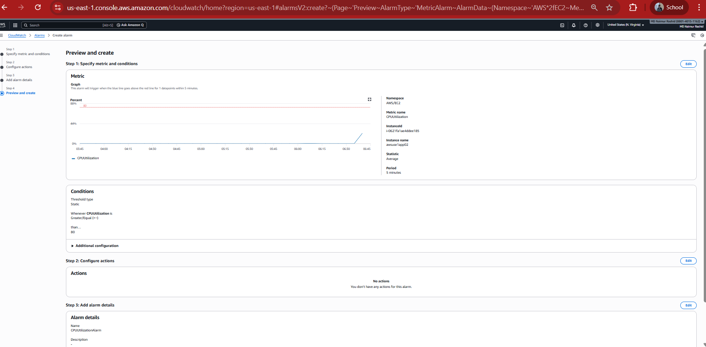

---

### Step 9️⃣: EC2 Connection Details
Reviewed EC2 SSH connection details including key pair and public IP.

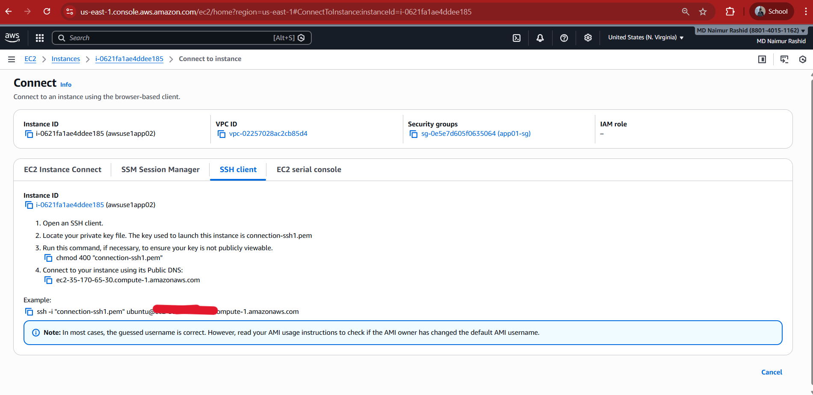

---

### Step 🔟: EC2 SSH Session via CloudShell
Connected to the EC2 instance securely using AWS CloudShell.

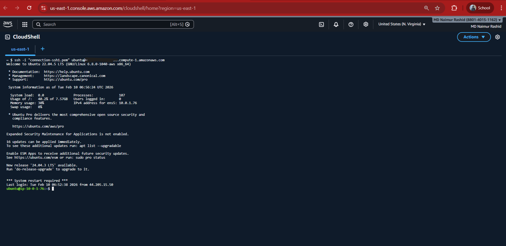

---

### Step 1️⃣1️⃣: Install Stress Tool on EC2

Installed the **stress-ng** utility on the EC2 instance to generate artificial CPU load for testing the CloudWatch alarm behavior.

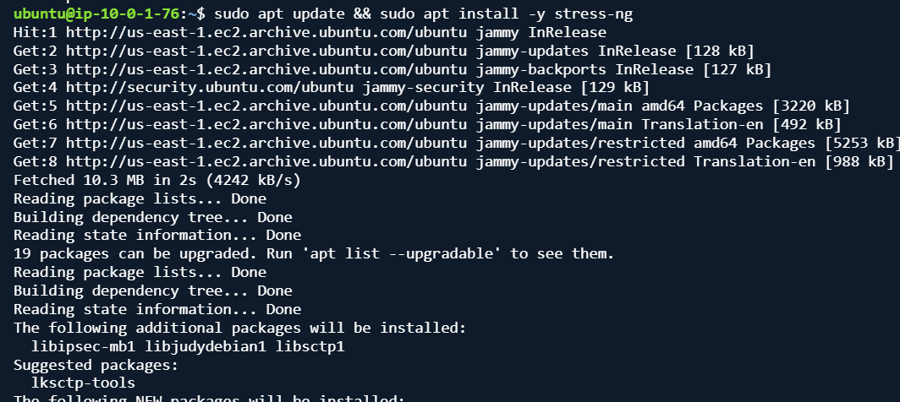

---

### Step 1️⃣2️⃣: Alarm in OK State (Before Load)

Verified that the CloudWatch alarm was initially in the **OK** state before generating CPU load.

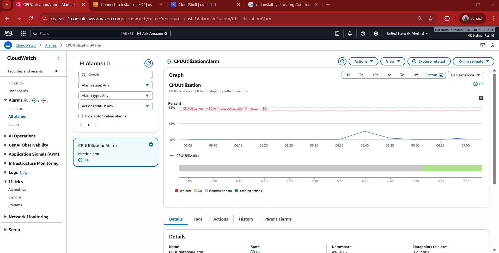

* * *

### Step 1️⃣3️⃣: Generate High CPU Load

Executed the stress test to increase CPU usage on the EC2 instance using the stress-ng tool.

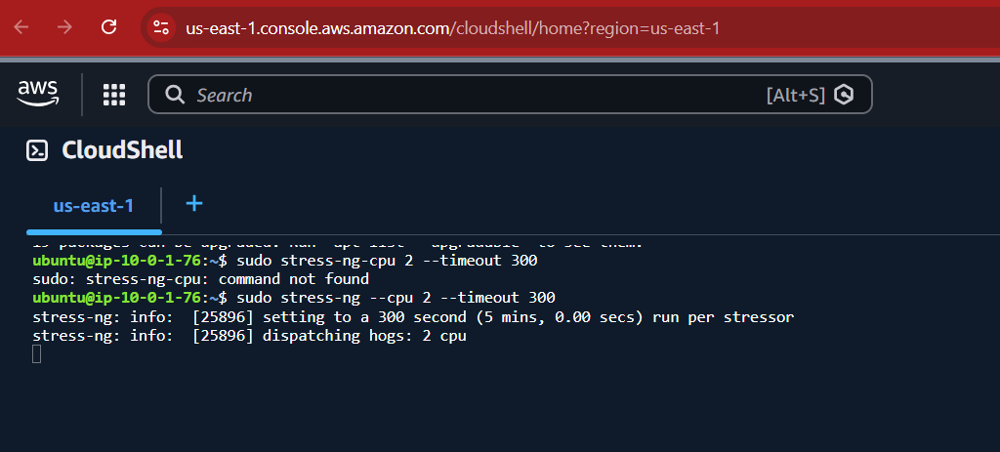

* * *

### Step 1️⃣4️⃣: Alarm Triggered (In Alarm State)

Observed the CloudWatch alarm transition from **OK** to **In Alarm** state due to high CPU utilization.

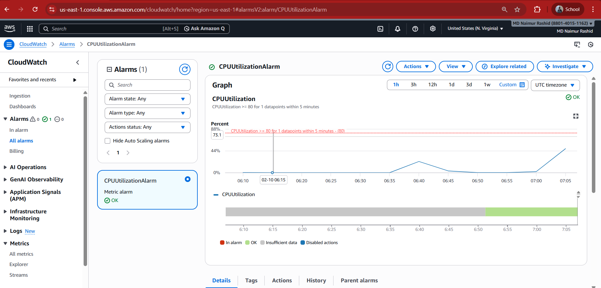

* * *

### Step 1️⃣5️⃣: High CPU Metrics Observed

Confirmed that CPU utilization exceeded the defined alarm threshold in CloudWatch metrics.

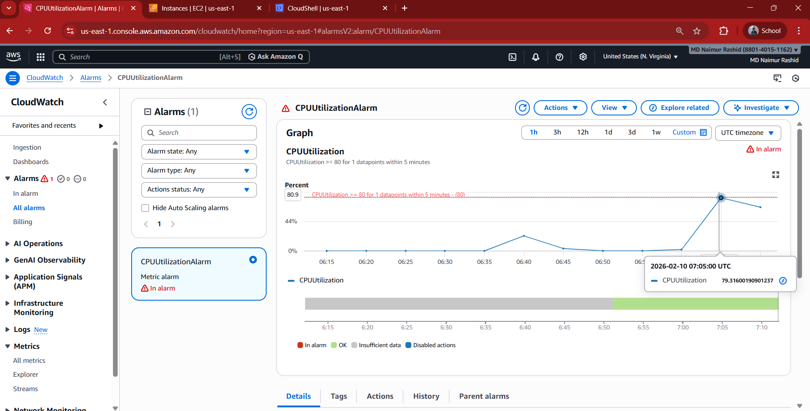

* * *

### Step 1️⃣6️⃣: CloudWatch Dashboard Creation

Created a CloudWatch dashboard to visualize EC2 metrics and alarm status in real time.

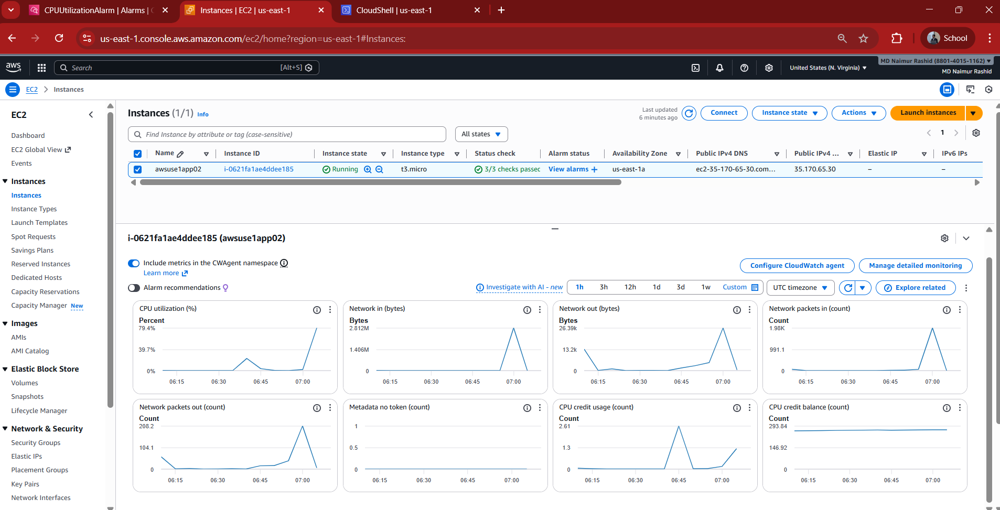

* * *

### Step 1️⃣7️⃣: Dashboard – Normal CPU State

Observed dashboard metrics after CPU usage returned to normal and the alarm recovered automatically.

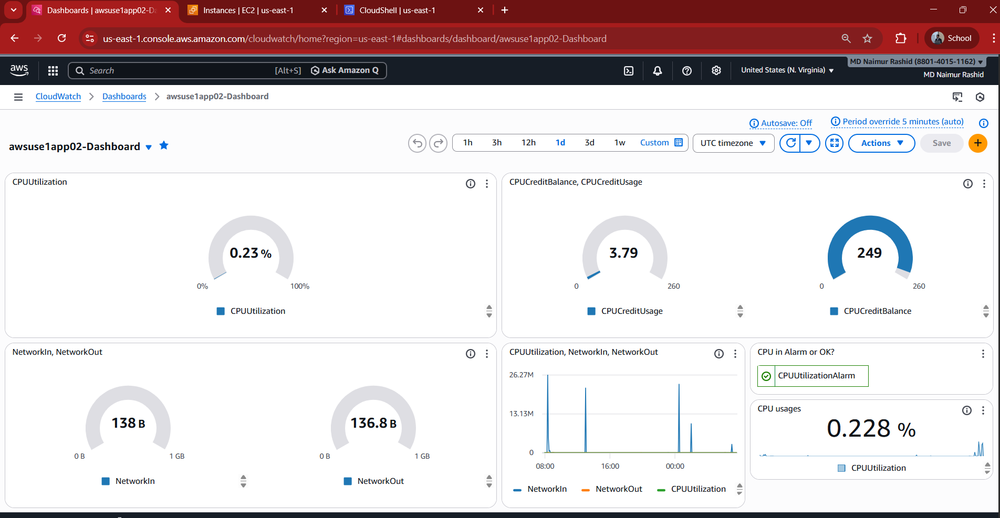

* * *

### Step 1️⃣8️⃣: Dashboard – Alarm State Visualization

Visualized the alarm state directly on the CloudWatch dashboard when CPU utilization was high.

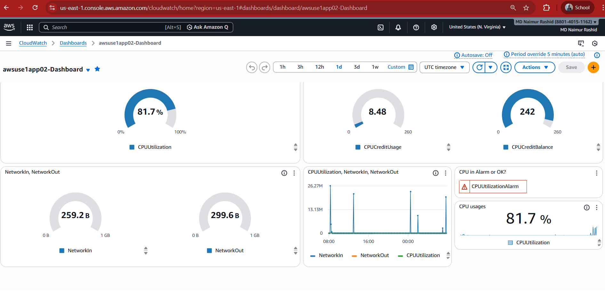

* * *

## 📊 Observations & Analysis

### CPU Metrics Comparison

* **Before load:** CPU utilization remained below 5%  
* **During load:** CPU utilization exceeded 80% and triggered the alarm  
* **After load:** CPU utilization returned to normal and the alarm moved back to OK  

**Explanation:**  
The stress-ng tool intentionally generated CPU load, validating real-time monitoring and alerting functionality using Amazon CloudWatch.

* * *

## 💰 Cost Awareness & Optimization

### High-Cost Resources

* EC2 compute usage  
* CloudWatch alarms and dashboards  
* Network traffic during load testing  

### Optimization Strategies

* Use burstable instance types efficiently  
* Stop or terminate idle EC2 instances  
* Reduce unnecessary monitoring retention  
* Configure AWS Budgets and cost alerts  

* * *

## ✅ Final Status

✔ Monitoring enabled  
✔ CPU alarm configured and tested  
✔ Load simulation performed  
✔ Alarm behavior verified  
✔ Dashboard created  

* * *

## 🧠 Learning Outcome

This lab provided hands-on experience with AWS observability tools, real-time monitoring, alarm testing, and highlighted the importance of performance visibility and cost awareness in cloud environments.

---
**MD Naimur Rashid**  
University of Frontier Technology
